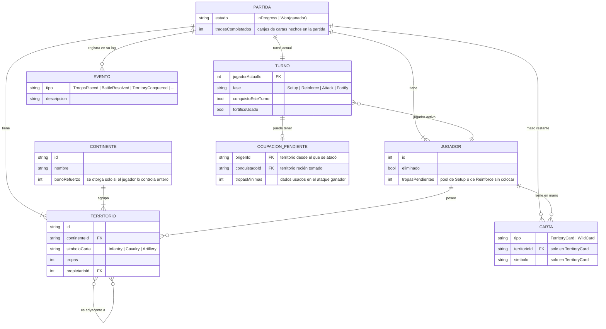

# Diagrama relacional (modelo de datos en memoria)

El proyecto no tiene base de datos ni capa de persistencia: `GameSessionService` (`src/Risk.Web/Services/GameSessionService.cs`) mantiene todo en memoria, registrado como *scoped* — una instancia por circuito de Blazor Server, es decir, una partida por pestaña. Este diagrama documenta el grafo de entidades de `Risk.Domain` + `Risk.Engine.State` con notación entidad-relación, como referencia del modelo de dominio y como punto de partida si algún día se agrega persistencia real.

## Notas de lectura

- **PARTIDA** corresponde al record `GameState` (`src/Risk.Engine/State/GameState.cs`): es la raíz inmutable de todo — cada comando produce una copia nueva (`state with { ... }`), nunca una mutación in-place.
- **JUGADOR** es `PlayerState`; su relación con **CARTA** es la mano (`Hand`), nunca visible completa para otro jugador — ver `PlayerView` en [casos-de-uso.md](casos-de-uso.md#uc-09--consultar-el-estado-de-la-partida-vista-redactada).
- **TERRITORIO** combina dos records: la parte fija (`Territory` en `Risk.Domain`: continente, símbolo de carta) y la parte mutable por partida (`TerritoryState` en `Risk.Engine`: dueño, tropas).
- La relación **TERRITORIO – TERRITORIO** ("es adyacente a") es el grafo fijo de 42 territorios de `WorldMap.Adjacency`, simétrico y con las rutas marítimas clásicas (Alaska-Kamchatka, Groenlandia-Islandia, Brasil-Norte de África, etc.), no solo fronteras terrestres.
- **TURNO** es `TurnState`: siempre hay exactamente un turno activo por partida, y como mucho una **OCUPACION_PENDIENTE** a la vez (bloquea cualquier comando que no sea resolverla).
- **EVENTO** es la jerarquía cerrada `GameEvent` (`src/Risk.Engine/Events/`): se acumula en `PARTIDA.Log` y también se devuelve por comando, para que la UI pueda animar solo el delta sin recorrer todo el historial.
- **CONTINENTE** (`Continents.All`) no se persiste por partida: es data estática de `Risk.Domain`, aquí incluida porque `Reinforcement.Calculate` la usa para calcular el bono de refuerzo de cada jugador.
