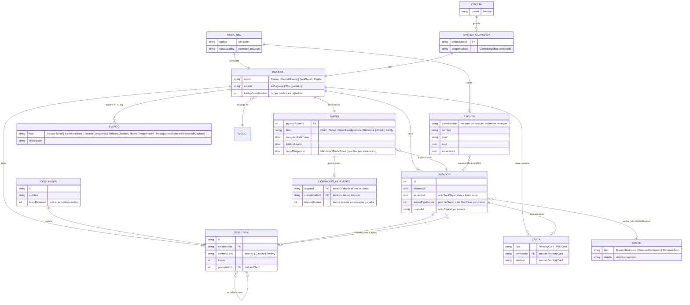

# Diagrama relacional (modelo de datos en memoria + persistencia opcional)

El juego en sí no necesita base de datos: `GameSessionService` (`src/Risk.Web/Services/GameSessionService.cs`) mantiene la partida en memoria, registrado como *scoped* — una instancia por circuito de Blazor Server, es decir, una partida hot-seat por pestaña. En red, `NetworkGameSession` (una por código de mesa, en el singleton `NetworkGameRegistry`) mantiene la `GameState` compartida entre circuitos; la garantía de información oculta es por ruteo (cada circuito solo renderiza su propio `Observe`). La única persistencia real es opcional: cuentas con Identity (`RiskDbContext` en SQL Server) para guardar/retomar (`IGameStore`/`EfGameStore`/`GameSnapshot`), nunca para el juego en curso.

```mermaid
erDiagram
    PARTIDA ||--|{ JUGADOR : "tiene"
    PARTIDA ||--|{ TERRITORIO : "tiene"
    PARTIDA ||--o{ CARTA : "mazo restante"
    PARTIDA ||--|| TURNO : "turno actual"
    PARTIDA ||--o{ EVENTO : "registra en su log"
    PARTIDA }o--|| MODO : "se juega en"
    CONTINENTE ||--|{ TERRITORIO : "agrupa"
    TERRITORIO }o--o{ TERRITORIO : "es adyacente a"
    JUGADOR ||--o{ TERRITORIO : "posee"
    JUGADOR ||--o{ CARTA : "tiene en mano"
    JUGADOR }o--o| MISION : "recibe (solo SecretMission)"
    JUGADOR }o--o| TERRITORIO : "cuartel (solo Capital)"
    TURNO }o--|| JUGADOR : "jugador activo"
    TURNO ||--o| OCUPACION_PENDIENTE : "puede tener"
    MESA_RED ||--|{ ASIENTO : "sienta"
    MESA_RED ||--|| PARTIDA : "comparte"
    ASIENTO }o--o| JUGADOR : "mapea a (EngineIdFor)"
    CUENTA ||--o| PARTIDA_GUARDADA : "guarda"
    PARTIDA_GUARDADA ||--|| PARTIDA : "foto"

    PARTIDA {
        string modo "Classic | SecretMission | TwoPlayer | Capital"
        string estado "InProgress | Won(ganador)"
        int tradesCompletados "canjes hechos en la partida"
    }
    JUGADOR {
        int id
        bool eliminado
        bool esNeutral "solo TwoPlayer; nunca toma turno"
        int tropasPendientes "pool de Setup o de Reinforce sin colocar"
        string cuartelId "solo Capital, write-once"
    }
    TERRITORIO {
        string id
        string continenteId FK
        string simboloCarta "Infantry | Cavalry | Artillery"
        int tropas
        int propietarioId FK "null en Claim"
    }
    CONTINENTE {
        string id
        string nombre
        int bonoRefuerzo "solo si se controla entero"
    }
    CARTA {
        string tipo "TerritoryCard | WildCard"
        string territorioId FK "solo en TerritoryCard"
        string simbolo "solo en TerritoryCard"
    }
    MISION {
        string tipo "OccupyTerritories | ConquerContinents | EliminateArmy"
        string detalle "objetivo concreto"
    }
    TURNO {
        int jugadorActualId FK
        string fase "Claim | Setup | SelectHeadquarters | Reinforce | Attack | Fortify"
        bool conquistoEsteTurno
        bool fortificoUsado
        bool canjeObligatorio "MandatoryTradeDown (overflow por eliminacion)"
    }
    OCUPACION_PENDIENTE {
        string origenId FK "territorio desde el que se ataco"
        string conquistadoId FK "territorio recien tomado"
        int tropasMinimas "dados usados en el ataque ganador"
    }
    EVENTO {
        string tipo "TroopsPlaced | BattleResolved | TerritoryConquered | TerritoryClaimed | NeutralTroopsPlaced | HeadquartersSelected/Revealed/Captured | ..."
        string descripcion
    }
    MESA_RED {
        string codigo "join code"
        string estadoLobby "curando | en juego"
    }
    ASIENTO {
        string claveEstable "reclamo por circuito; sobrevive recargas"
        string nombre
        string color
        bool esIA
        bool espectador
    }
    CUENTA {
        string userId "Identity"
    }
    PARTIDA_GUARDADA {
        string ownerUserId FK
        string snapshotJson "GameSnapshot versionado"
    }
```

## Notas de lectura

- **PARTIDA** corresponde al record `GameState` (`src/Risk.Engine/State/GameState.cs`): es la raíz inmutable de todo — cada comando produce una copia nueva (`state with { ... }`), nunca una mutación in-place. `Mode` (`GameMode`) fija victoria (`IVictoryRule`), setup (`ISetupStrategy`) y rangos (2 exacto en `TwoPlayer`, 3–5 en el resto; pools 40/35/30/25).
- **JUGADOR** es `PlayerState`: mano (`Hand`, solo visible completa para su dueño vía `PlayerView` — ver [casos-de-uso.md](casos-de-uso.md#uc-09--consultar-el-estado-de-la-partida-vista-redactada)), `IsEliminated`, `TroopsRemaining`, `IsNeutral` (tercer ejército de `TwoPlayer`: solo recibe colocaciones en Setup fase B, nunca turno ni refuerzos), `HeadquartersId` (write-once en `SelectHeadquarters`, designa territorio — el control actual se deriva de `Territories[id].Owner`) y `Mission` (write-once en el reparto de `SecretMission`).
- **TERRITORIO** combina dos records: la parte fija (`Territory` en `Risk.Domain`: continente, símbolo de carta) y la parte mutable por partida (`TerritoryState` en `Risk.Engine`: dueño nullable en `Claim`, tropas).
- La relación **TERRITORIO – TERRITORIO** ("es adyacente a") es el grafo fijo de 42 territorios de `WorldMap.Adjacency`, simétrico y con las rutas marítimas clásicas (Alaska-Kamchatka, Groenlandia-Islandia, Brasil-Norte de África, etc.), no solo fronteras terrestres. El layout de pantalla (`Risk.Web/Models/TerritoryLayout.cs`, coordenadas hechas a mano sobre `world-map.png` 1340x876) vive aparte y no es parte de este grafo.
- **TURNO** es `TurnState`: siempre hay exactamente un turno activo por partida, y como mucho una **OCUPACION_PENDIENTE** a la vez (bloquea cualquier comando que no sea resolverla). `MandatoryTradeDown` se arma al eliminar y dejar al eliminador en 6+ cartas, y se limpia al canjear hasta ≤4.
- **EVENTO** es la jerarquía cerrada `GameEvent` (`src/Risk.Engine/Events/`): se acumula en `PARTIDA.Log` y también se devuelve por comando, para que la UI pueda animar solo el delta sin recorrer todo el historial.
- **CONTINENTE** (`Continents.All`) no se persiste por partida: es data estática de `Risk.Domain`, aquí incluida porque `Reinforcement.Calculate` la usa para el bono de refuerzo.
- **MESA_RED/ASIENTO** es `NetworkGameSession` + `NetworkGameRegistry` + `NetworkedSeatContext`: una mesa por código compartida entre circuitos; el asiento (clave estable por reclamo) mapea al `PlayerId` del motor vía `EngineIdFor` (permite curar el roster y reenganchar tras recargas). `Dispatch` filtra por asiento y el motor sigue siendo la autoridad de regla. Espectadores y circuitos sin asiento son solo-lectura por construcción.
- **CUENTA/PARTIDA_GUARDADA** es `ApplicationUser` + `EfGameStore` (`RiskDbContext`, SQL Server): una fila por usuario con el `GameSnapshot` (JSON versionado). Guardar es manual y opcional; anónimo = sin fila y sin llamadas al store. Ganar borra la fila. Los asientos IA (`PlayerConfig.IsAi`, bots de `Risk.AI` con `BotMemory`) no se persisten como entidades: se reconstruyen al arrancar/retomar.
